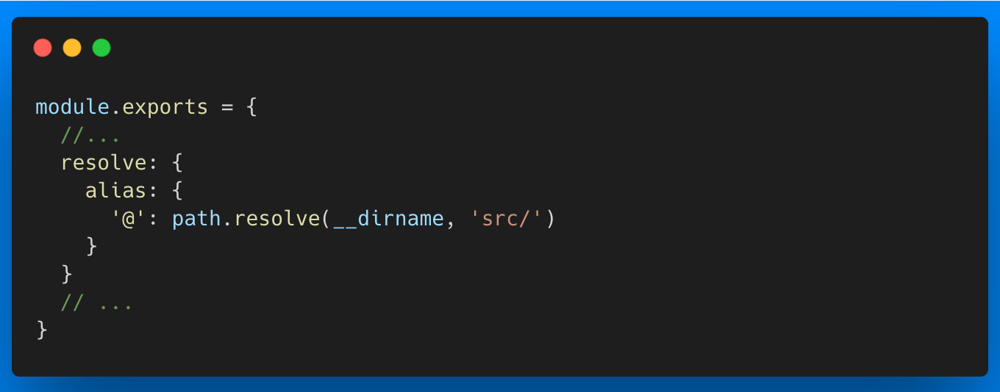
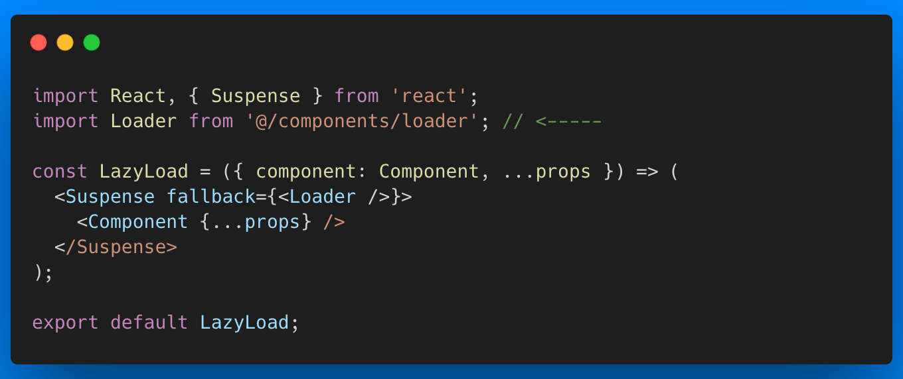

# alias-resolver

The main idea of this extension is to automatically pick your alias configuration, and resolve all these aliases throughout the code. VSCode has a way to do this by defining a `jsconfig.json` file, but this means that you have to make the file and in case you change the aliases you need to modify them in at least two places.

This extension is heavily inspired on webstorm's behavior, it reads the webpack configuration, and resolve the aliases based on this.

What if you don't use webpack? Well, this extension lets you define which file you want it to read. So you could use rollup for instance.

## Features

Imagine this webpack configuration

and look at this React component example

Most probably you would like your editor to know where that route to that file is. So you can autocomplete, or even navigate to the different folders or the file. This extension will resolve that route for you.

It is also a must that vscode autocompletes this kind of routes when we are typing an import. This extension will do that too!

## Extension Settings

This extension contributes the following settings:

- `alias-resolver.file`: File where your alias definition is.
