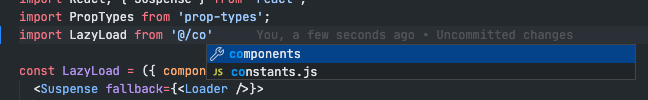

# alias-resolver

The main idea of this extension is to automatically pick your alias configuration, and resolve all these aliases throughout the code. VSCode has a way to do this by defining a `jsconfig.json` file, but this means that you have to make the file and in case you change the aliases you need to modify them in at least two places.

This extension is heavily inspired on webstorm's behavior, it reads the webpack configuration, and resolve the aliases based on this.

What if you don't use webpack? Well, this extension lets you define which file you want it to read and you can also customize the way it access to the object.

## Features

Imagine this webpack configuration


and look at this React component example


Most probably you would like your editor to know where that route to that file is. So you can autocomplete, or even navigate to the different folders or the file. This extension will resolve that route for you.

It is also a must that vscode autocompletes this kind of routes when we are typing an import. This extension will do that too!



## Extension Settings

This extension contributes the following settings:

- `alias-resolver.file`: File where your alias definition is.
- `alias-resolver.type`: The type of config you will be using. [webpack | rollup | custom]
- `alias-resolve.accessPath`: This settings lets you define where do you aliases leave. For instance, if you export an object from your file with a shape like this:

```js
module.exports = {
  a: {
    b: {
      alias: {
        '@': path.resolve(__dirname, 'src/')
      }
    }
  }
}
```

This setting would be `a.b.alias`. If you are exporting an object with aliases directly on the root, then you can ignore this setting, or leave it as an empty string.

## Extension commands

```json
      {
        "command": "alias-resolver.updateConfigFile",
        "title": "Update configuration file",
        "category": "Alias resolver"
      },
      {
        "command": "alias-resolver.updateConfigType",
        "title": "Update configuration type",
        "category": "Alias resolver"
      },
      {
        "command": "alias-resolver.updateConfigAccessType",
        "title": "Update configuration access path to object",
        "category": "Alias resolver"
      }
```